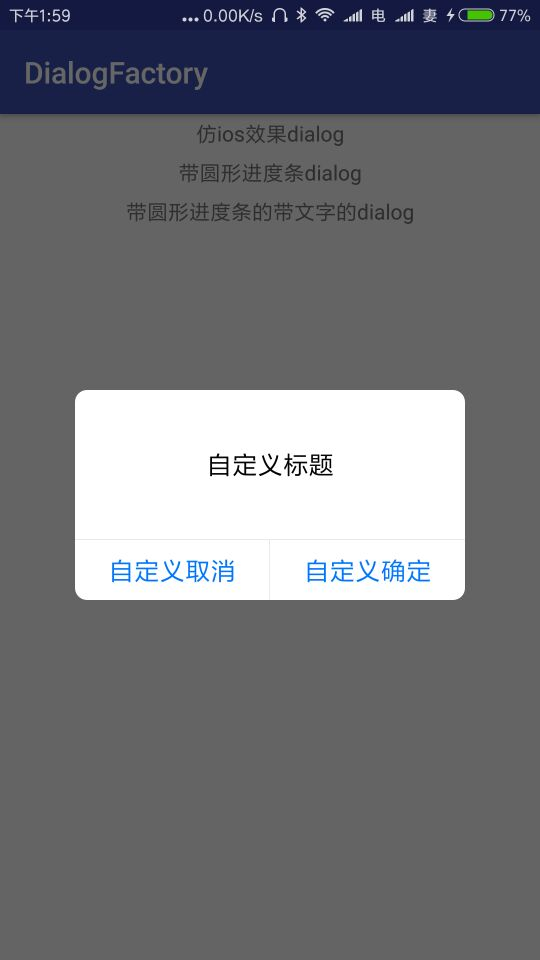
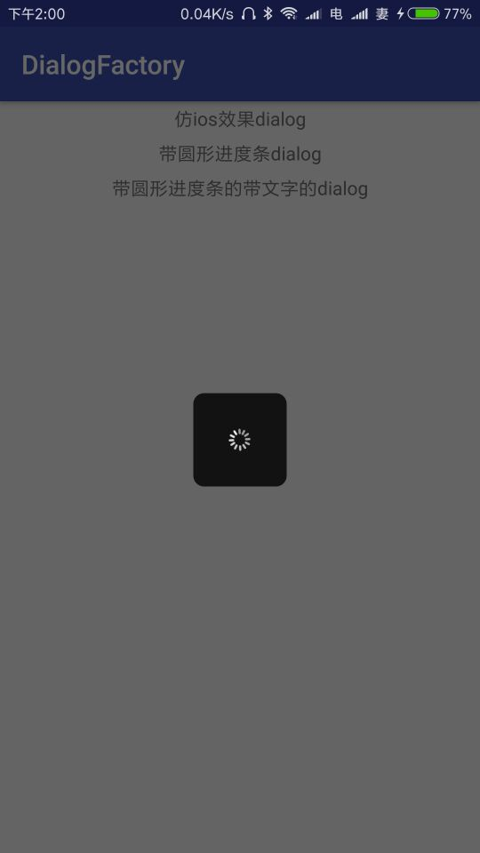
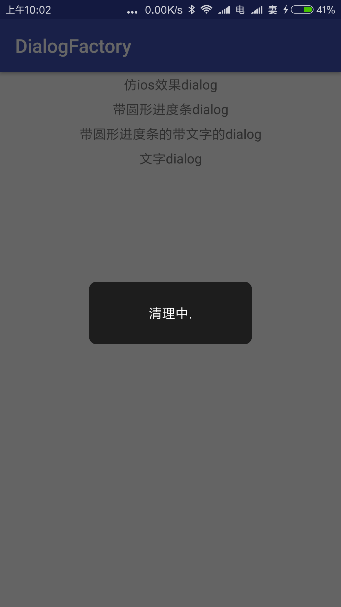

# DialogFactory
Dialog库  仿ios对话框 带进度的dialog  带文字和进度条的dialog

# 样式
+ IOSDialog
	+ 
+ ProgressDialog
	+ 
+ ProgressTextDialog
	+ 
+ TextDialog
	+ 

# 项目添加方法
在根 build.gradle中添加
```
allprojects {
    repositories {
        ...
        maven { url 'https://jitpack.io' }
    }
}
```

在项目build.gradle中添加 
```
dependencies {
    compile 'com.github.ronghao:DialogFactory:1.0.1'
}
```

# 关于
+ 个人博客：[www.haohaohu.com](http://www.haohaohu.com/)
+ 如果你也喜欢这个库，Star一下吧，欢迎Fork

# License

    Copyright 2016 haohaohu

    Licensed under the Apache License, Version 2.0 (the "License");
    you may not use this file except in compliance with the License.
    You may obtain a copy of the License at

       http://www.apache.org/licenses/LICENSE-2.0

    Unless required by applicable law or agreed to in writing, software
    distributed under the License is distributed on an "AS IS" BASIS,
    WITHOUT WARRANTIES OR CONDITIONS OF ANY KIND, either express or implied.
    See the License for the specific language governing permissions and
    limitations under the License.
